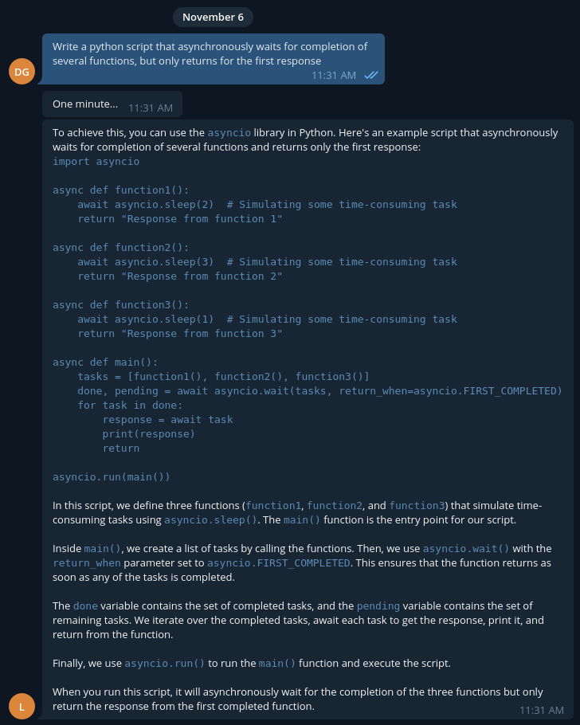

# G4f Telegram Bot

Chat GPT telegram bot powered by gpt4free and telebot

Features:
+ Chat GPT conversations powered by g4f library
+ Image generations using various Stable Diffusion 1.5/XL models
+ Math module powered by WolframAlpha API

Downsides:
+ Parallelism is acheived through multiprocessing library, had no luck with asyncio
+ Math module is dependant on WolframAlpha
+ Bots LLM capability is highly dependant on providers

## Setup
 1) ```git clone https://github.com/DeniskaRediska21/G4f_telegram_bot.git```
 2) ```sudo apt install python3.10 python3.10-venv xargs```
 2) To use Image generation capabilities, setup cuda and pytorch on your PC, untill `torch.cuda.is_available` returns `True`
 2) ```cd G4f_telegram_bot```
 3) ```python3 -m venv bot```
 3) ```source bot/bin/activate```
 4) ```cat requirements.txt | xargs -n 1 pip install```
 5) Create config.py file
 6) Paste to config.py:  ```BOT_TOKEN = "<Token provided by @BotFather>"
 WOLFRAM_ID = "<App ID provided by WolframAlpha>"
 HF_TOKEN = "<Huggingface token provided by Huggingface>"```
 7) **To run bot in terminal:** ```sourse bot/bin/activate
 python3 telebot_bot.py```

## Chatting with ChatGPT

To get ChatGPT reply, write anything to bot, without any commands.

## Image Generation

To generate image with StableDiffusion write your image prompt after `/draw` command.
Ex.:

Other commands in Image generation:
+ `/models` to reveal the list of all supported models
+ `/diffusers` to reveal current Image generation settings
+ `/diffusers <setting name> <setting>` to change settings

List of Image generation settings:
+ refine True/False - use the StableDiffusionXL refiner on the generated image
+ upscale True/False - use the ESRGAN upscaler on the generated image
+ negative <text> - negative prompt used for generation
+ guidance <float> - guidance scale used fprgeneration, defines how much creativity the model will use
+ height <int> - height of the generated image
+ width <int> - wifth of the generated image
+ refiner_steps <int> - StableDiffusionXL refiner steps
+ steps <int> - StableDiffussion steps
+ model <1word> - model that will be used for generation, model namescan be derrived by running `/models` command
+ lcm True/False - use Latent Consistency Model for generation **greatly reduces genration times, while slightly reducing quality**
+ vae <1word> - VAE that will be used while generating **original** to run VAE provided by the diffusion model creator, **mse** - the stable_diffusion_api MSE VAE,
 **ema** stable diffusion api EMA VAE, **none** standart Diffusers library VAE 

## Math module

`/math <math expression>` - to get a responce from WolframAlpha, only text responces are supported ATM.

## Showcase of formatting


